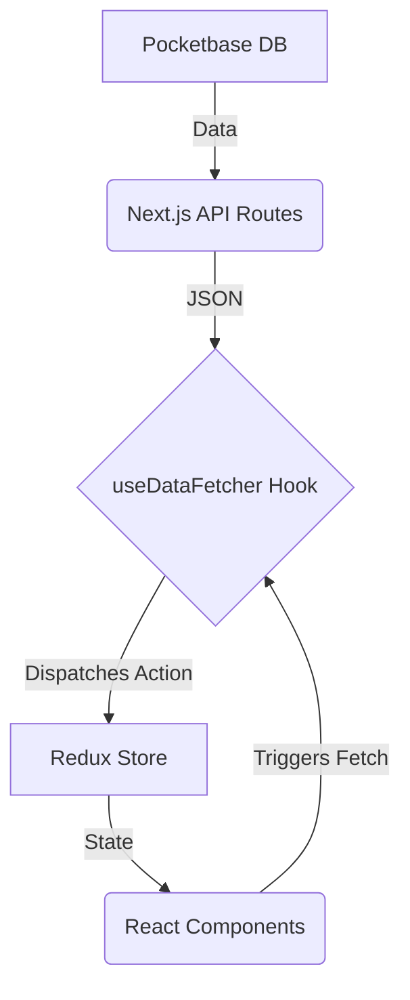
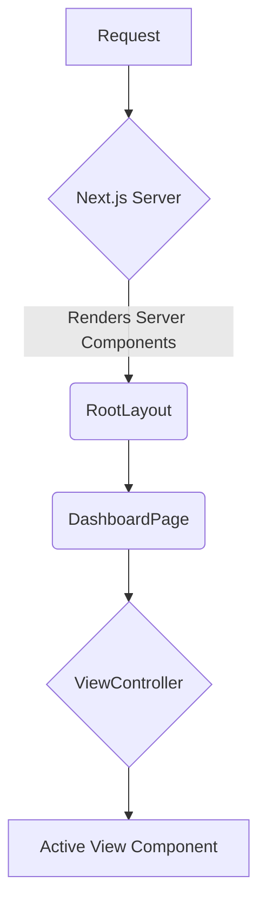

# Application Architecture and Flow

This document provides an overview of the data and rendering flow of the application.

## 1. High-Level Architecture

The application is a [Next.js](https://nextjs.org/) application built with the App Router. It uses [React](https://react.dev/) and [Tailwind CSS](https://tailwindcss.com/) for the user interface.

- **Backend**: [Pocketbase](https://pocketbase.io/) is used as the backend database and authentication service.
- **API Layer**: The Next.js application has an API layer built with API Routes that communicates with Pocketbase.
- **Frontend**: The frontend is built with React and Next.js. It uses [Redux Toolkit](https://redux-toolkit.js.org/) for state management.
- **UI Components**: The UI is built using a combination of custom components and components from [Radix UI](https://www.radix-ui.com/) for accessibility, `sonner` for toast notifications, and `lucide-react` for icons.

## 2. Authentication Flow

Authentication is handled by Pocketbase, and the session is managed using a cookie.

1.  **Login**: The user enters their credentials on the `/login` page. The application makes a request to the Pocketbase server to authenticate the user.
2.  **Cookie**: Upon successful authentication, Pocketbase sets an `pb_auth` cookie in the user's browser.
3.  **Middleware**: A Next.js middleware (`middleware.ts`) is configured to run on protected routes (e.g., `/dashboard`). This middleware checks for the presence of the `pb_auth` cookie.
4.  **Route Protection**: If the `pb_auth` cookie is present, the user is allowed to access the protected route. If not, they are redirected to the `/login` page.
5.  **Authenticated API Requests**: When the frontend makes requests to the Next.js API routes, the `pb_auth` cookie is automatically included in the request headers. The API routes can then use this cookie to initialize the Pocketbase SDK on behalf of the authenticated user.

## 3. Data Flow

The data flow can be summarized as follows: Pocketbase -> Next.js API Routes -> Redux Store -> React Components.

1.  **Pocketbase**: This is the single source of truth for all data.
2.  **Next.js API Routes**: The `app/api` directory contains routes that fetch data from Pocketbase. These routes handle the communication with the Pocketbase SDK, including authentication and data transformation.
3.  **`useDataFetcher` Hook**: This custom hook (`lib/hooks.ts`) is used by client-side components to fetch data. It encapsulates the logic of making `fetch` requests to the Next.js API routes and dispatching the returned data to the Redux store.
4.  **Redux Store**: The Redux store (`lib/store/store.ts`) holds the application's client-side state. The state is organized into slices (e.g., `sessionsSlice`).
5.  **React Components**: Components use the `useAppSelector` hook to subscribe to the Redux store and get the data they need. They use the `useDataFetcher` hook to trigger data fetching.

## 4. Rendering Flow

The application uses a combination of Server Components and Client Components, leveraging the features of the Next.js App Router.

1.  **Root Layout (`app/layout.tsx`)**: This is a Server Component that provides the basic HTML structure of the application. It wraps the application in the `StoreProvider` for Redux.
2.  **Pages (e.g., `app/dashboard/page.tsx`)**: The page components are primarily Client Components (`'use client'`). They are responsible for fetching data and managing the state of the page.
3.  **`ViewController` Component**: The `DashboardPage` uses a `ViewController` component. This component is responsible for rendering the currently active view (e.g., `ShiftsViewer`, `NotesViewer`, `StudentsViewer`) based on the application state.
4.  **View Components (e.g., `ShiftsViewer`, `NotesViewer`)**: These are also Client Components that are responsible for displaying a specific part of the dashboard. They fetch their data using the `useDataFetcher` hook and subscribe to the Redux store for updates.
5.  **Rendering**: When a user navigates to a page, Next.js renders the Server Components on the server and sends the resulting HTML to the client. The Client Components are then hydrated and rendered on the client, where they can fetch data and interact with the user.

## 5. State Management

Client-side state is managed using **Redux Toolkit**.

- **Store**: The store is configured in `lib/store/store.ts`. It contains a single `sessions` slice.
- **Slice (`lib/store/states/sessionsSlice.ts`)**: This slice manages all the state related to user sessions, shifts, notes, etc. It defines the initial state and the reducers to update the state.
- **Actions**: The `sessionsSlice` automatically creates actions for each reducer. These actions are dispatched by the `useDataFetcher` hook to update the store with new data from the API.
- **Selectors**: Components use the `useAppSelector` hook to select and read data from the store.

This architecture provides a clear separation of concerns, with a well-defined data flow and a flexible rendering strategy. The use of custom hooks and Redux Toolkit helps to keep the code organized and maintainable.
