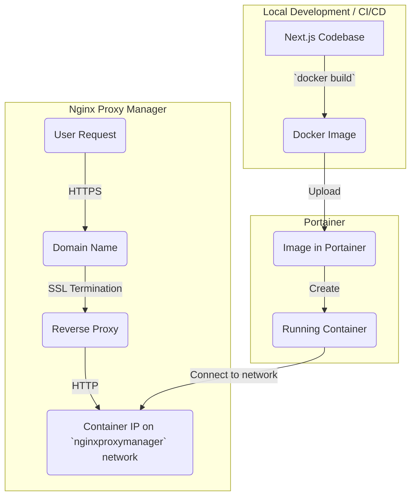

# Deployment Lifecycle Architecture

This document outlines the process for deploying the Next.js application using Docker, Portainer, and Nginx Proxy Manager.

## 1. Overview

The deployment strategy is centered around creating a self-contained Docker image of the Next.js application and managing it through Portainer. Nginx Proxy Manager is used as a reverse proxy to handle incoming traffic, provide SSL termination, and route requests to the application container.

## 2. Deployment Flow

The following diagram illustrates the end-to-end deployment process:



## 3. Step-by-Step Guide

### Step 1: Build the Docker Image

The project includes a multi-stage `Dockerfile` that handles the entire build process, including running `npm run build` internally. This creates a lean and secure Docker image with a standalone Next.js server.

1.  **Build the image**:
    ```bash
    docker build -t your-image-name:latest .
    ```
    You can also pass build-time arguments if needed:
    ```bash
    docker build --build-arg NEXT_PUBLIC_POCKETBASE_URL=https://your-pocketbase-url.com -t your-image-name:latest .
    ```

### Step 2: Upload to Portainer

1.  **Navigate to your Portainer instance**.
2.  Go to the **Images** section.
3.  **Upload the Docker image** you built in the previous step.

### Step 3: Create the Container in Portainer

1.  From the **Images** section in Portainer, find your uploaded image and click **Deploy** or **Create container**.
2.  **Configure the container**:
    *   Give the container a name.
    *   Map the container's port `3000` to a host port (e.g., `3001:3000`).
    *   Under **Advanced container settings > Network**, connect the container to the `nginxproxymanager` network.
3.  **Deploy the container**.

### Step 4: Configure Nginx Proxy Manager

1.  **Navigate to your Nginx Proxy Manager instance**.
2.  Go to **Hosts > Proxy Hosts** and click **Add Proxy Host**.
3.  **Configure the proxy host**:
    *   **Domain Names**: Enter the domain name for your application (e.g., `app.yourdomain.com`).
    *   **Scheme**: `http`.
    *   **Forward Hostname / IP**: Enter the IP address of the container you created in Portainer. You can find this in the container details in Portainer.
    *   **Forward Port**: `3000` (the internal port of the container).
4.  **SSL**: Go to the **SSL** tab, select your desired SSL certificate (e.g., request a new Let's Encrypt certificate), and enable **Force SSL**.
5.  **Save** the proxy host.

After these steps, your application will be deployed and accessible at your chosen domain name with a valid SSL certificate.
